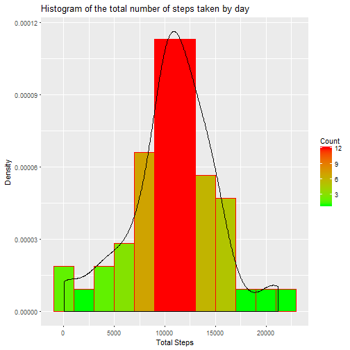
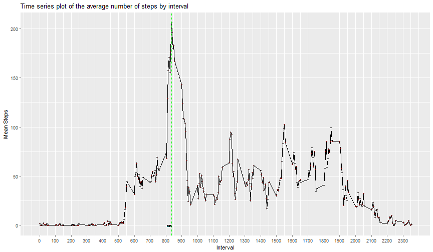
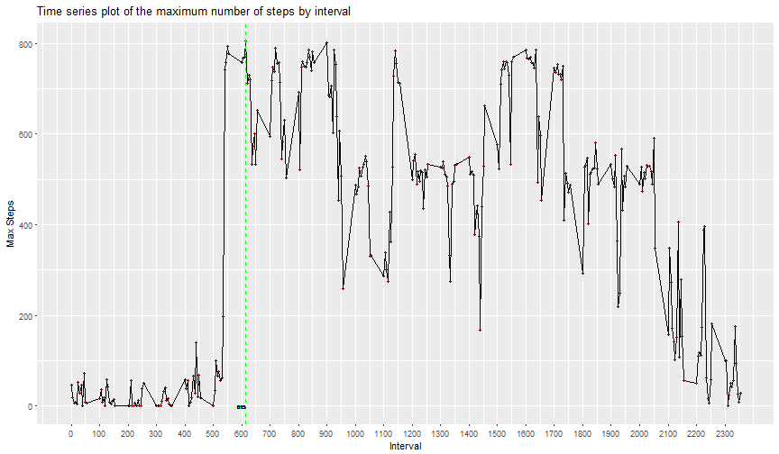
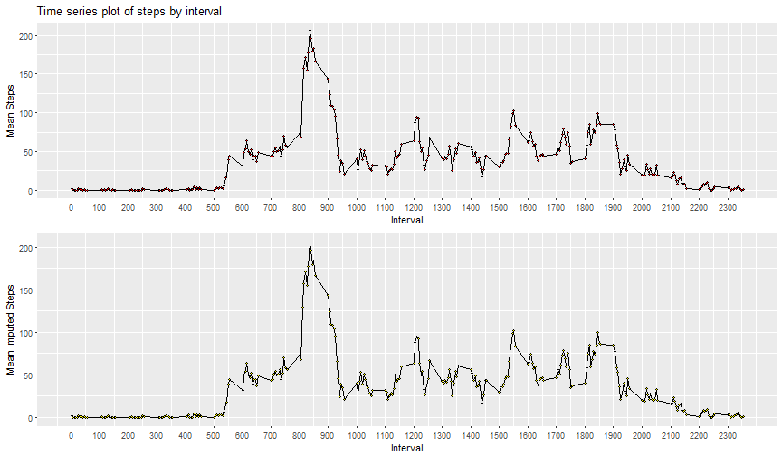
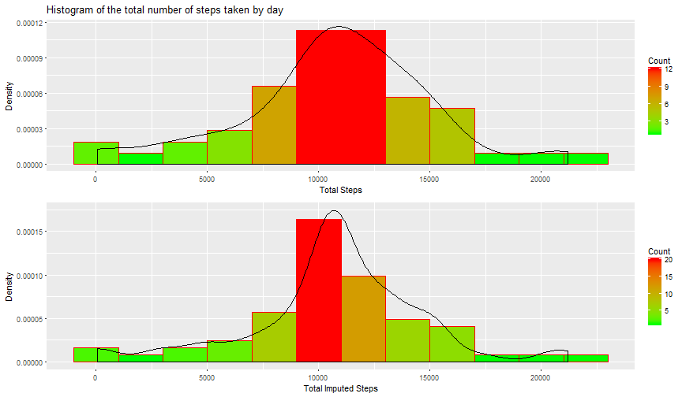
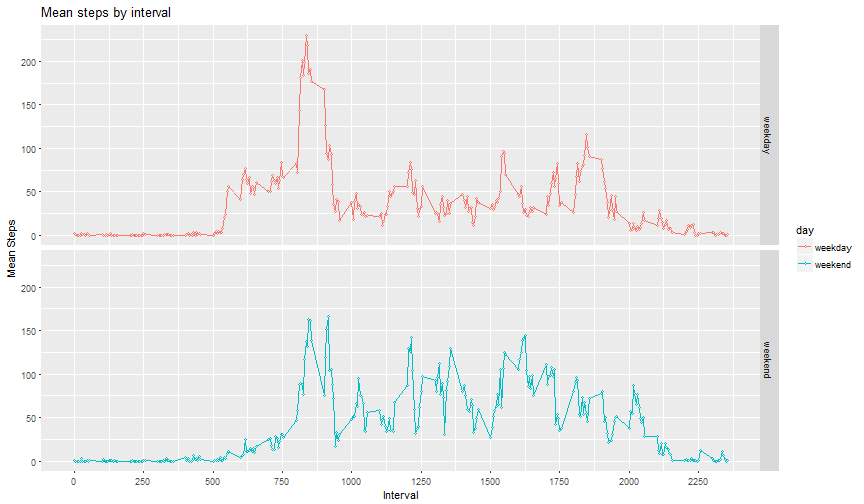

## Week2 Project
### Below are the objectives of the project:-  
1.Histogram of the total number of steps taken each day  
2.Mean and median number of steps taken each day  
3.Time series plot of the average number of steps taken  
4.The 5-minute interval that, on average, contains the maximum number of steps  
5.Show strategy for imputing missing data  
6.Histogram of the total number of steps taken each day after missing values are imputed  
7.Panel plot comparing the average number of steps taken per 5-minute interval across weekdays and weekends  

#### General processing

```r
library(Hmisc)
library(dplyr)
library(ggplot2)
library(plyr)
library(gridExtra)
setwd("C:/Users/212446591/Desktop/coursera/Assignment/5. Reproducible Research/Week2/Project")
csv <- read.csv("activity.csv")
new_df<-tbl_df(csv)
```
  
  
#### Objective 1: Histogram of the total number of steps taken each day 
  

```r
## Adding weekday/end definition
new_df <- mutate(new_df,day = ifelse(weekdays(as.Date(date)) %in% c("Saturday","Sunday"),"weekend","weekday"))
## Aggregate data frame by date
TotalSteps<-aggregate(new_df$steps, by=list(Day=new_df$date), FUN=sum,na.rm=TRUE)
# 0 values are removed from histogram
TotalSteps <- filter(TotalSteps,x != 0)
## Plotting
p1<-ggplot(data=TotalSteps, aes(TotalSteps$x)) +  
  geom_histogram(col="red",binwidth=2000,aes(fill=..count..,y=..density..) ) +  
  scale_fill_gradient("Count", low = "green", high = "red") + 
  xlab("Total Steps") + ylab("Density") + geom_density() + ggtitle("Histogram of the total number of steps taken by day")
print(p1)
```



#### Objective 2: Mean and median number of steps taken each day

```r
## Summarize mean & Median  by date
ddply(new_df, .(date), summarize, mean=mean(steps,na.rm=TRUE), median=median(steps))
```

```
##          date       mean median
## 1  2012-10-01        NaN     NA
## 2  2012-10-02  0.4375000      0
## 3  2012-10-03 39.4166667      0
## 4  2012-10-04 42.0694444      0
## 5  2012-10-05 46.1597222      0
## 6  2012-10-06 53.5416667      0
## 7  2012-10-07 38.2465278      0
## 8  2012-10-08        NaN     NA
## 9  2012-10-09 44.4826389      0
## 10 2012-10-10 34.3750000      0
## 11 2012-10-11 35.7777778      0
## 12 2012-10-12 60.3541667      0
## 13 2012-10-13 43.1458333      0
## 14 2012-10-14 52.4236111      0
## 15 2012-10-15 35.2048611      0
## 16 2012-10-16 52.3750000      0
## 17 2012-10-17 46.7083333      0
## 18 2012-10-18 34.9166667      0
## 19 2012-10-19 41.0729167      0
## 20 2012-10-20 36.0937500      0
## 21 2012-10-21 30.6284722      0
## 22 2012-10-22 46.7361111      0
## 23 2012-10-23 30.9652778      0
## 24 2012-10-24 29.0104167      0
## 25 2012-10-25  8.6527778      0
## 26 2012-10-26 23.5347222      0
## 27 2012-10-27 35.1354167      0
## 28 2012-10-28 39.7847222      0
## 29 2012-10-29 17.4236111      0
## 30 2012-10-30 34.0937500      0
## 31 2012-10-31 53.5208333      0
## 32 2012-11-01        NaN     NA
## 33 2012-11-02 36.8055556      0
## 34 2012-11-03 36.7048611      0
## 35 2012-11-04        NaN     NA
## 36 2012-11-05 36.2465278      0
## 37 2012-11-06 28.9375000      0
## 38 2012-11-07 44.7326389      0
## 39 2012-11-08 11.1770833      0
## 40 2012-11-09        NaN     NA
## 41 2012-11-10        NaN     NA
## 42 2012-11-11 43.7777778      0
## 43 2012-11-12 37.3784722      0
## 44 2012-11-13 25.4722222      0
## 45 2012-11-14        NaN     NA
## 46 2012-11-15  0.1423611      0
## 47 2012-11-16 18.8923611      0
## 48 2012-11-17 49.7881944      0
## 49 2012-11-18 52.4652778      0
## 50 2012-11-19 30.6979167      0
## 51 2012-11-20 15.5277778      0
## 52 2012-11-21 44.3993056      0
## 53 2012-11-22 70.9270833      0
## 54 2012-11-23 73.5902778      0
## 55 2012-11-24 50.2708333      0
## 56 2012-11-25 41.0902778      0
## 57 2012-11-26 38.7569444      0
## 58 2012-11-27 47.3819444      0
## 59 2012-11-28 35.3576389      0
## 60 2012-11-29 24.4687500      0
## 61 2012-11-30        NaN     NA
```


#### Objective 3: Time series plot of the average number of steps taken

```r
## Aggregate data frame by interval and find mean & Max
TotalSteps_by_Interval<-ddply(new_df, .(interval), summarize,Mean=mean(steps,na.rm=TRUE),Max=max(steps,na.rm=TRUE))
## Find data which has maximum mean across days by interval
max_Mean_interval<-TotalSteps_by_Interval[which.max(TotalSteps_by_Interval$Mean),]$interval
## Plotting
ggplot(data = TotalSteps_by_Interval, aes(x = interval, y = Mean)) + 
  geom_line() + geom_point(size=1, shape=21, fill="red") + 
  xlab("Interval") +   ylab("Mean Steps") + 
  scale_x_continuous(breaks=seq(0,2355,100)) + ggtitle("Time series plot of the average number of steps by interval") +
  geom_vline(aes(xintercept=max_Mean_interval), colour="#00FF00", linetype="dashed") + 
  geom_text(aes(max_Mean_interval, 0, label = max_Mean_interval, hjust = 1), size = 2)
```



#### Objective 4: The 5-minute interval that, on average, contains the maximum number of steps 

```r
## Find data which has maximum steps across days by interval
max_interval<-TotalSteps_by_Interval[which.max(TotalSteps_by_Interval$Max),]$interval
## Plotting
ggplot(data = TotalSteps_by_Interval, aes(x = interval, y = Max)) + 
  geom_line()+   geom_point(size=1, shape=21, fill="red") + 
  xlab("Interval") + ylab("Max Steps") +
  scale_x_continuous(breaks=seq(0,2355,100)) + ggtitle("Time series plot of the maximum number of steps by interval") +
  geom_vline(aes(xintercept=max_interval), colour="#00FF00", linetype="dashed") + 
  geom_text(aes(max_interval, 0, label = max_interval, hjust = 1), size = 2)
```



#### Objective 5: Show strategy for imputing missing
There are __13.1147541__ % missing values of steps in complete dateset.  

#####Strategy for imputing data:  
1. Divide the dataset by group of interval
2. Find the mean of that group of interval
3. Substituting NAs with mean of that group 

##### Comparing Lineplots of Mean by Interval 

```r
## Imputing missing steps values using Hmisc pacakge
new_df<-ddply(new_df, .(interval), transform, imputed_steps = impute(steps,mean))
## Mean and median after imputing. Not printed on the markdown
Mean_Median_Steps1<-ddply(new_df, .(date), summarize, mean=mean(imputed_steps), median=median(imputed_steps))
## Aggregate data frame by interval and find mean for imputed steps
TotalSteps_by_Interval1<-ddply(new_df, .(interval), summarize, Mean=mean(imputed_steps))
## Plotting
p3<-ggplot(data = TotalSteps_by_Interval, aes(x = interval, y = Mean)) + 
  geom_line()+  geom_point(size=1, shape=21, fill="red") + 
  xlab("Interval") +   ylab("Mean Steps") + ggtitle("Time series plot of steps by interval") +scale_x_continuous(breaks=seq(0,2355,100))
p4 <-ggplot(data = TotalSteps_by_Interval1, aes(x = interval, y = Mean)) + 
  geom_line()+  geom_point(size=1, shape=21, fill="yellow") + 
  xlab("Interval") + ylab("Mean Imputed Steps") + scale_x_continuous(breaks=seq(0,2355,100))
## comparing side by side
grid.arrange(p3, p4, nrow=2)
```



_Above plot shows that imputed values fit perfectly._  

  
  
#### Objective 6: Comparing Histograms

```r
## Aggregate data frame by date
TotalSteps_imputed<-aggregate(new_df$imputed_steps, by=list(Day=new_df$date), FUN=sum)
## plotting with imputed values
p2 <- ggplot(data=TotalSteps_imputed, aes(TotalSteps_imputed$x)) + 
  geom_histogram(col="red",binwidth=2000,aes(fill=..count..,y=..density..) ) +  
  scale_fill_gradient("Count", low = "green", high = "red") + 
  xlab("Total Imputed Steps") +   ylab("Density") +   geom_density()
## comparing side by side
grid.arrange(p1, p2, nrow=2)
```


  
  
#### Objective 7: Panel plot comparing the average number of steps taken per 5-minute interval across weekdays and weekends  


  

```r
## find data of average imputed steps by interval for all weekday
wkday_TotalSteps_by_Interval <- ddply(filter(new_df,day=="weekday"), .(interval), summarize, Mean=mean(imputed_steps))
wkday_TotalSteps_by_Interval$day = "weekday"
## find data of average imputed steps by interval for all weekend
wendday_TotalSteps_by_Interval<-ddply(filter(new_df,day=="weekend"), .(interval), summarize, Mean=mean(imputed_steps))
wendday_TotalSteps_by_Interval$day = "weekend"
## row level binding
new_df1 <- rbind(wkday_TotalSteps_by_Interval,wendday_TotalSteps_by_Interval)
## plotting
ggplot(data = new_df1, aes(x = interval, y = Mean,color=day)) + geom_line()+
  geom_point(size=1, shape=21, fill="white") + xlab("Interval") + ylab("Mean Steps") +  facet_grid(day~ .) + ggtitle("Mean steps by interval") + scale_x_continuous(breaks=seq(0,2355,250))
```



#### Cleanup

```r
rm(new_df1)
rm(new_df)
rm(TotalSteps_by_Interval)
rm(TotalSteps_by_Interval1)
rm(wkday_TotalSteps_by_Interval)
rm(wendday_TotalSteps_by_Interval)
rm(TotalSteps_imputed)
rm(p1)
rm(p2)
rm(p3)
rm(p4)
```
